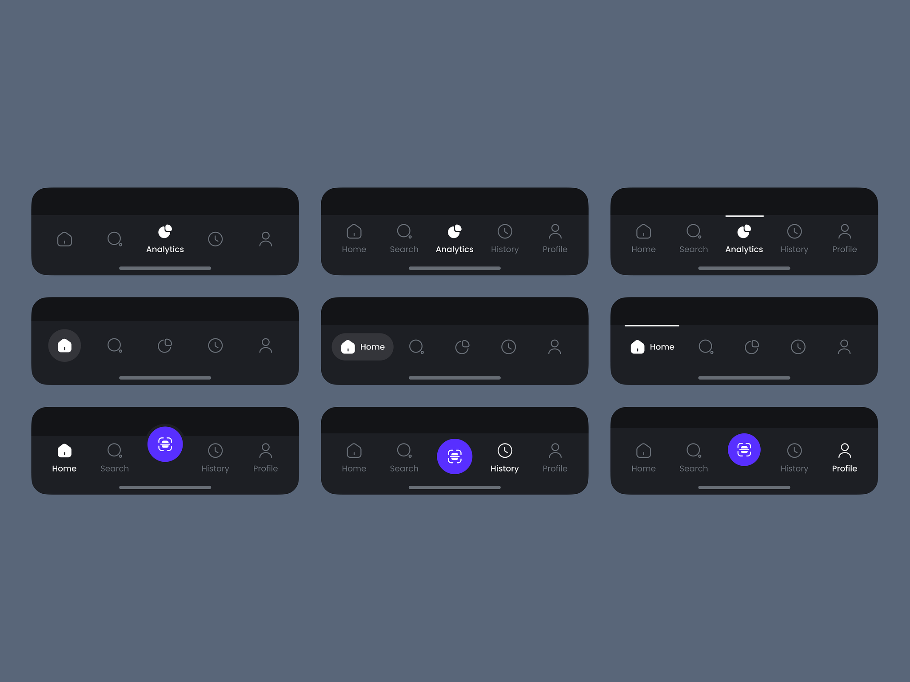
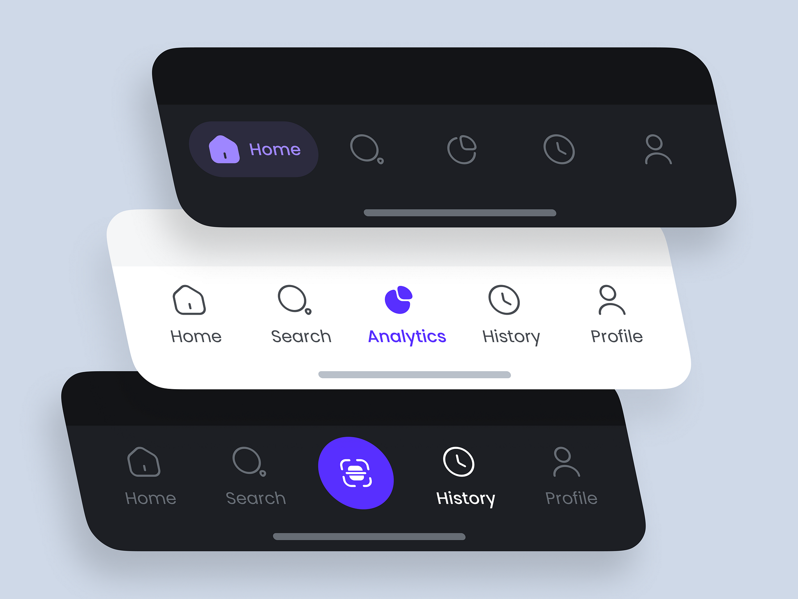
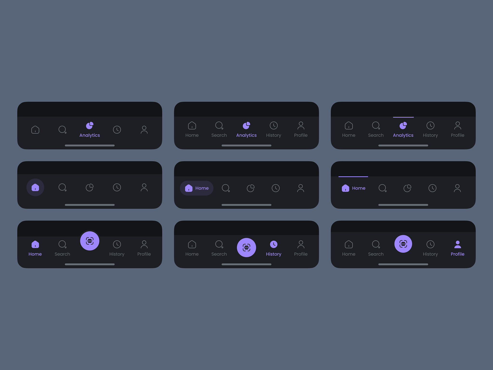
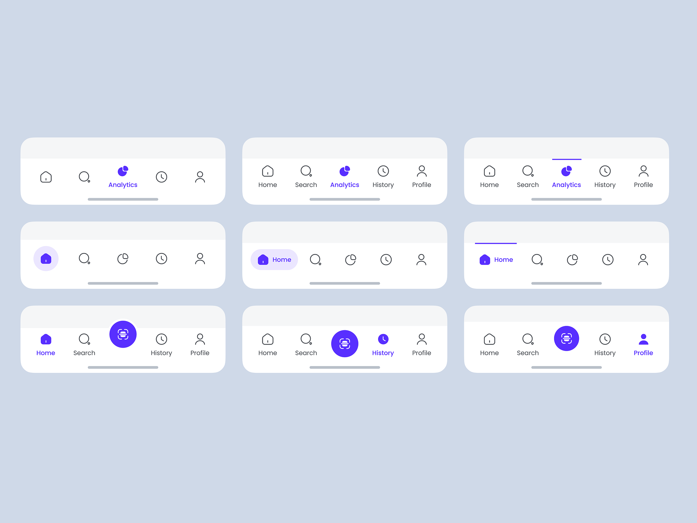

# Современная Навигация в React Native

Добро пожаловать в проект Современная Навигация в React Native! Этот репозиторий демонстрирует различные современные техники навигации в React Native. Мы стремимся предоставить исчерпывающее руководство и примеры для реализации различных навигационных шаблонов, обеспечивая бесшовный и интуитивно понятный пользовательский опыт.

## Структура Проекта

Проект структурирован на несколько веток, каждая из которых демонстрирует определенный тип навигации. Существует до шести типов навигации, каждый из которых находится в своей ветке. Ветки названы численно для легкой идентификации.

## URL Репозитория

Вы можете найти репозиторий [здесь](https://github.com/HipsterSantos/r-native-modern-navigation).

## Типы Навигации

1. **Стековая Навигация**
   - Демонстрирует использование навигации на основе стека, где экраны накладываются друг на друга.
   - Позволяет пользователям перемещаться вперед и назад по стеку.
   - 

2. **Навигация по Вкладкам**
   - Реализует навигацию по вкладкам с вкладками внизу или вверху экрана.
   - Пользователи могут переключаться между различными вкладками для просмотра различных разделов приложения.
   - 

3. **Навигация через Боковое Меню**
   - Показывает боковое меню, которое выдвигается слева или справа.
   - Пользователи могут открывать меню для перехода на разные экраны или разделы.
   - 

4. **Нижняя Навигация**
   - Содержит нижнюю навигационную панель с иконками и надписями.
   - Обеспечивает быстрый доступ к основным разделам приложения.
   - 

5. **Верхняя Навигация**
   - Включает верхнюю навигационную панель, часто используемую для разделов внутри одного экрана.
   - Подходит для организации контента в структуру, похожую на вкладки.
   - 

6. **Кастомная Навигация**
   - Исследует решения кастомной навигации, адаптированные к специфическим потребностям.
   - Демонстрирует креативные и уникальные навигационные шаблоны.
   - 

## Видео Демонстрация

Посмотрите видео демонстрацию, чтобы увидеть эти типы навигации в действии:

[](public/original-f340c550de127c2a57a724194098aa20.mp4)

Нажмите на миниатюру, чтобы посмотреть демонстрационное видео.

## Начало Работы

### Необходимые Условия

- Node.js
- npm или yarn
- React Native CLI

### Установка

1. Клонируйте репозиторий:

   ```bash
   git clone https://github.com/HipsterSantos/r-native-modern-navigation.git
   cd r-native-modern-navigation
